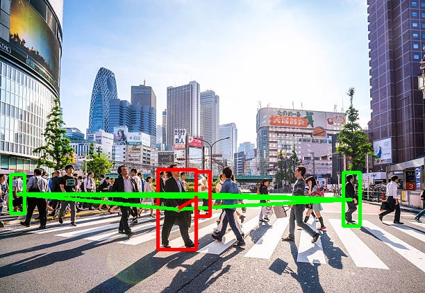

# Distance Detection
* This project is about finding the distance between the people and alert them at the time of **plague**. \


# Installation
* To use this project, follow the given command:
```bash
git clone git@github.com:Mohanlal-11/Skills_Enhancement.git
cd Social_Distance_Finding
pip install -r Social_Distance_Finding/requirements.txt
```
# To see the demo:
* First download the weights for object detection model from [pretrained_wts](https://drive.google.com/file/d/1G3bDza_qtRbtPt0s1Oj68D7PXjLBrhx6/view?usp=sharing) and put in this folder, then run following command if you want to see demo on one image:
```bash 
python3 Distance_Alert.py
```
* if you want to see the demo on video, then put a video on folder data, uncomment the line 19 and lines from 184 to 216 and comment the lines from 177 to 181, then run following command:
```bash 
python3 Distance_Alert.py --path data/name of your video file
```
